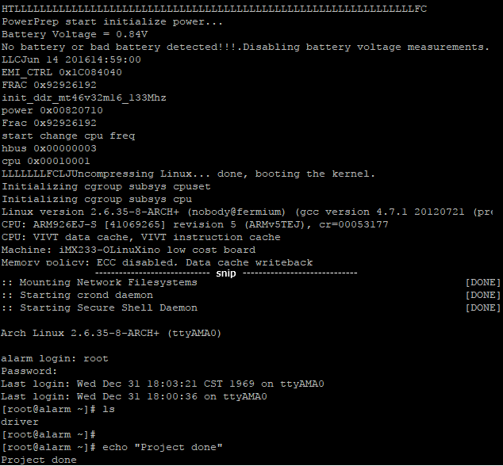
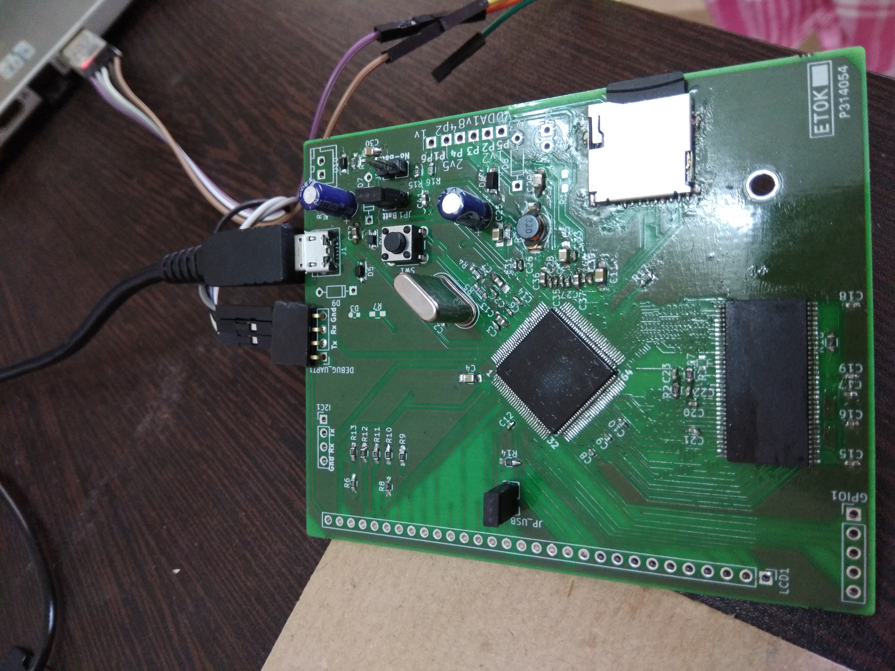
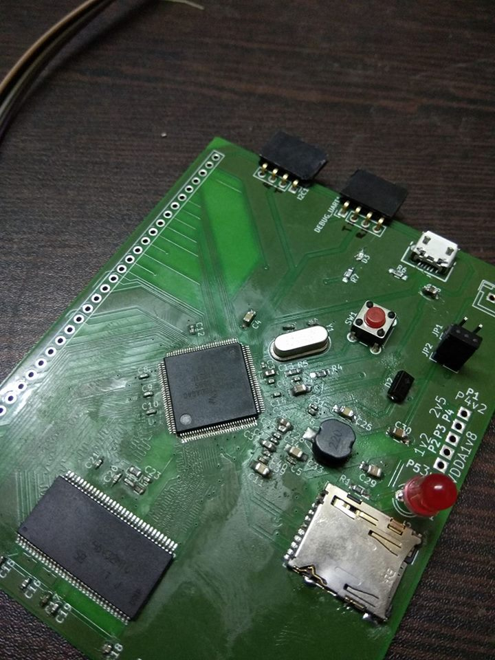

# Let me see if I can build a linux Computer

I am starting to build a single board computer with freescale microprocessor iMX233 128 LQFP and 64MB DDR2 SDRAM in 66TSOP. This single board computer will be bare bones with lots of GPIO exposed.
There is no special goal for this project. I am just curious to see if it works. In future I might add an LCD. The PCB is two layered only and can be manufactured cheap.

## TODOs (done)
* Increase pad lengths of LQFP footprint. (done. Hope to mitigate the soldermask between pads issue  |<-0.06mm space-><-0.08mm web-><-0.06mm space->|  = 0.2mm) 
* Perhaps add a jumper on the 2.5v LineReg and separate out VDD_MEM to be able to test the 2.5v is not 0 due to loading. (skipped)
* 88 USB_ID SSP1_DETECT ? Should I use this to CD of SD card connector or micro USB ID pin?  In my circuit it is pulled low via LED. Tux,calculator does the same too.
* Add option to boot resistors LCD_RS and LCD_00..LCD_05 (done)
* 14 LCD_RS ? High for register boot mode. Or low with 47k resistor for OTP boot mode. Olimex is confusing OTP is set MMBR and LCD_RS is high. (done)
* Schottkey Diode D1 VDD4P2 direction. Its strange in ref diagram vs 5v wall. VDD4P2 -|>||- VDDBATT. (done Optional. Not populated in running board)
* Series resistor 1E for preventing oscillations (done 3 series resistor added, usb, batt, 4p2)
/in old circuit Test by removing Diode, and LED_RS to gnd via resistor.
* RESET circuit? Make sure not to get into USB recovery mode. add zener 1.0v so that it never reached 3.3v or just remove reset circuit altogether.
* Configure to get rid of batteries as per rev-c circuit. Add 1k resistors in DCDC_BATT and BATT and some caps to GND.
* Need to convert the SD card connector to a cheaper version available on ebay or alibaba. (done part-ATTEND 112J-TDAR-R01)
I got the files from https://forum.kicad.info/t/microsd-component-footprint-help/3095/5 and placed in parts/ folder. 
It would be awesome if I can find some 3D model of it. If someone finds it please create an issue. (Yes found)
* Make DDR RAM pin pads longer (new)
* Make alternate USB plug preferably through hole or longer pads in micro USB. (new)
* Make micro-SD pads larger and longer and add a few decoupling capacitors.(new)
* Make more rooms for the inductor as most inductors are really big 8mm long plus place for hand soldering.(new)

## TODOs (ignored)
* POWER off circuit? 
* Is Micro SD pullups on all pins necessary? SSP1_DETECT used? (done added them in the bottom side. Data3/CS pulled low)
* Added 120R between CLK nCLK.

### Length Tuning
* D0..D7 LDQS LDM - 39.7mm tuning (real 40.2mm)
* CLK nCLK - real 32.2/32.6mm
* D8..D15 UDQS UDM - 25.5mm tuning (real 26.0mm)
* Address: 32.35mm ~ 25mm
* CKE- 20.2mm
* SD: 24.8mm tuning (real 25.3mm)

## Installation steps
Cloning this repository should work.
It does use opendous
conn_fci from https://github.com/cpavlina/kicad-pcblib.git, https://github.com/cpavlina/kicad-schlib.git
Copy kicad-pcblib\conn-fci.pretty to  KiCad\share\kicad\modules\conn-fci.pretty
Add kicad-schlib-master\library\conn-fci.lib  to SchematicEditor -> ComponentLibraries
Add opendous to component libraries too.

## Drivers for this project.
* Until recently I didn't know of a decent opensource software for PCB designing or circuit designing which can be used to design complicated circuits involving microprocessor.
I recently discovered KiCAD which is opensource pcb designing software and people have done microprocessor design with it eg. OLinuXino. I am trying to learn PCB designing using KiCAD now.
* Second driver was Clementine Core project which I saw in circuitmaker website. This schematic looked so simple and pcb was on 2 layer design, which changed my thought process altogether that linux running board designs may be something I can try.
* Third driver was LibreCalc which almost proved that KiCAD can be used to design IMX233 based board. I hope to learn from their mistakes, but a newbee like me can uncover a whole lot of new mystries.

So I have put together a mashup of schematic design of IMX233 and 64MB RAM from freescale reference design and other sources. 

**Freescale microprocessor:**
* MCIMX233CAG4C

**DDR RAM - I think all these below RAM chips are compatible.**
* AS4C32M16MD1-5TCN
* HY5DU121622D(L)T(P)-J
* MT46V32M16P-5B:J (This is the only one I can source, so I am using this)

This project is a work in progress and there is no gurantee that I will ever be able to complete it :).

But if you want to try building same stuff as I am building. Go ahead and fork it.
Download KiCad. I am using nightly version of it, because it does not require you to export the netlist and import it again in pcb editor. Make the workflow really easy.
I can see one bug in KiCAD, which is after modifying the footprint by adding a step file. It looses the saved settings. 

Once you have installed KiCAD, open **MyIMX233.pro** file. 

[MyIMX233.sch](MyIMX233.sch) - Schematic file.

[MyIMX233.kicad_pcb](MyIMX233.kicad_pcb) - PCB

[ReferenceSch](ReferenceSch) - contains reference materials. I uploaded all of them for providing content incase someone wants to understand the design.

## Progress: 

### Oct 8 It worked! You can start building one today for yourself :)
Few soldering quirks are there. USB pads are quite small to solder. Also pad to hold USB in place is also very small and bad for soldering. Even the SD card pads are also small for soldering. These were new footprints so in next version I will make longer pads for these. RAM pads can be made slightly longer for reliable soldering. 
Soldered board and powered up without SD card. Some error were coming 0x80207002. Boot loader looking for I2C and it is not initialized. Turned out to be soldering of one pin was not proper for LQFP128. Fixed this pin issue then SD card missing related errors were coming. Added SD card with bogus data 0x8020A007 - ERROR_DDI_SD_CONFIG_BLOCK_NOT_FOUND. Added SD card formatted properly but still 0x8020A007. Little bit further digging showed that SD card MBR boot is not enabled by default. We need to burn an OPT bit HW_OCOTP_ROM0::SD_MBR_BOOT to enable booting from SD card. This process is irreversible. Default boot mode is BCB. I read up again librecalc's failure blog.  It gave two perl programs to burn the SD card with u-boot in BCB mode. The 2nd perl program didn't run as it assumed smaller SD cards only. I edited the perl program to make it find proper boot signatures. Now we can see something HTLC in UART console.
That's too less info to debug further. At this point I posted in freescale community. https://community.nxp.com/message/949934. I decided to blow the MBR OTP flag using BitBurner. Then added MBR based uSD card and same u-boot. Now again it shows HTLC. Good news is that MBR booting works. But it fails very soon. Need bootlets which gives more detailed log instead of u-boot. Turned out voltages are fluctuating all 3v3, 4v2, 1v8, 1v. They were fluctuating in a cycle. I burned official Olinuxino image in SD card. That seems to have bootlets so it gave more info. After right after memory `FRAC 0x92926192` it reboots. I heated up all the pins of DDR and iMX233 with soldering iron. It goes 1 more line ahead in log `init_ddr_mt46v32m16_133Mhz` and sometimes `power 0x00820710`. I added a big capacitor in place of battery which goes the log to further and says uSD card general error ending with r14<0>HTLLLL... I tried adding a few caps on 3v3. But nothing helped. Then I tried the other jumper of battery mode. Then it started loading kernel. 

### Aug 2017
Started modifying the schematic to make battery and USB wall power optional using jumpers. Also realized boot selection can be done using resistors. Sent for fabrication of PCB to pcbpower.

### July 2017 end first soldered board
Good news is most of the components fitted. Also I got some confidence about my KiCAD skills.
Some shortcomings were observed, like the pads for soldering were two short for the fine pitched LQFP128 0.4mm pitch and solder mask dams were not created between pads which made it incredibly hard to solder. I will have to customize the LQFP128 footprint to make it suitable for hand soldering. Some 0402 caps were placed very close, I realized the courtyard verification of components is not turned on by default. I had limited success like UART was working USB was working, BitBurner was working and showing all the OPT(One Time Programmable) bits. Some gibberish was coming on UART console. I used solder paste for soldering, so I thought some shorting might be happening. Then I tried to do reflow soldering to make the solder joints liquify once and then quickly cool it using a frying pan. It actually fried my board! I also mistakenly soldered uSD card with power on! Carelessness!

* I also ordered components. I didn't realize this would be a pain. element14 is not that accessible for an individual. I ordered mostly from Shelfkey and some from KitsNSpares. I am still tensed if footprints I chose will match the actual components. Second I am very much tensed about soldering 0402 components.
* Final version of PCB sent for fab in pcbpower. 

* Added few options to use DCDC. I was not comfortable of grounding DCDC_BATT and BATT pins, so I added a few jumpers. Also added provisions to add battery. 

* Learnt basic Freecad to build the Step files of DDR SDRAM 66TSOP. Here is the project I created - [MT46V32M16P-5B-Freecad-Step](https://github.com/samarjit/MT46V32M16P-5B-Freecad-Step).

* Initial version. DDR RAM child 3D missing and SD card's 3D missing.

* Learnt Length Matching in Kicad. 

* Figured out placement of components. I am going with Clementine Core's placement which seems very good. 

