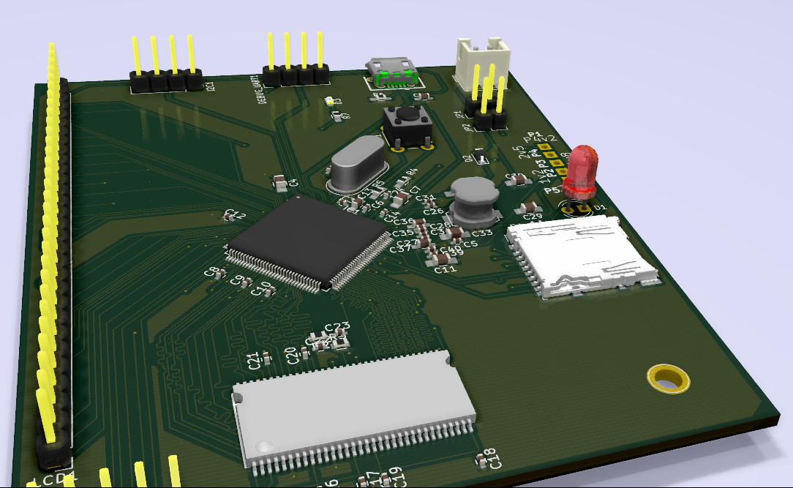
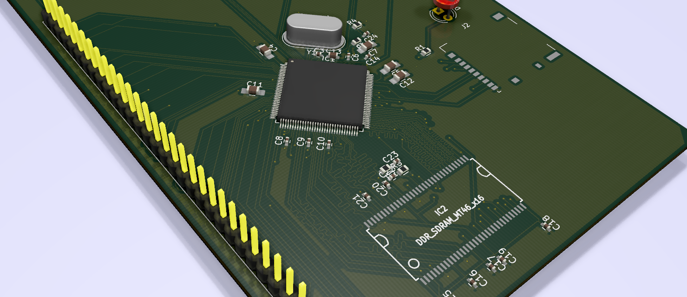

## Let me see if I can build a linux Computer

I am starting with freescale microprocessor MCIMX233 128 LQFP and 64MB DDR2 SDRAM.
There is no special goal for this project. I am just curious. 

Drivers for this project.
* Until recently I didn't know of a decent opensource software for PCB designing or circuit designing which can be used to design complicated circuits involving microprocessor.
I recently discovered KiCAD which is opensource pcb designing software and people have done microprocessor design with it eg. OLinuXino. I am trying to learn PCB designing using KiCAD now.
* Second driver was Clementine Core project which I saw in circuitmaker website. This schematic looked so simple and pcb was on 2 layer design, which changed my thought process altogether that linux running board designs may be something I can try.
* Third driver was LibreCalc which almost proved that KiCAD can be used to design IMX233 based board. I hope to learn from their mistakes, but a newbee like me can uncover a whole lot of new mystries.

So I have put together a mashup of schematic design of IMX233 and 64MB RAM from freescale reference design and other sources. 

Freescale microprocessor:
* MCIMX233CAG4C

I think all these below RAM chips are compatible. 
* AS4C32M16MD1-5TCN
* HY5DU121622D(L)T(P)-J
* MT46V32M16P-5B:J (This is the only one I can source, so I am using this)

This project is a work in progress and there is no gurantee that I will ever be able to complete it :).

But if you want to try building same stuff as I am building. Go ahead and fork it.
Download KiCad. I am using nightly version of it, because it does not require you to export the netlist and import it again in pcb editor. Make the workflow really easy.
I can see one bug in KiCAD, which is after modifying the footprint by adding a step file. It looses the saved settings. 

Once you have installed KiCAD, open **MyIMX233.pro** file. 

[MyIMX233.sch](MyIMX233.sch) - Schematic file.
[MyIMX233.kicad_pcb](MyIMX233.kicad_pcb) - PCB
[ReferenceSch](ReferenceSch) - contains reference materials. I uploaded all of them for providing content incase someone wants to understand the design.

Progress: 

* I also ordered components. I didn't realize this would be a pain. element14 is not that accessible for an individual. I ordered mostly from Shelfkey and some from KitsNSpares. I am still tensed if footprints I chose will match the actual components. Second I am very much tensed about soldering 0402 components.
* Final version of PCB sent for fab in pcbpower. 

* Added few options to use DCDC. I was not comfortable of grounding DCDC_BATT and BATT pins, so I added a few jumpers. Also added provisions to add battery. 

* Learnt basic Freecad to build the Step files of DDR SDRAM 66TSOP. Here is the project I created - [MT46V32M16P-5B-Freecad-Step](https://github.com/samarjit/MT46V32M16P-5B-Freecad-Step).

* Initial version. DDR RAM child 3D missing and SD card's 3D missing.

* Learnt Length Matching in Kicad. 

* Figured out placement of components. I am going with Clementine Core's placement which seems very good. 

